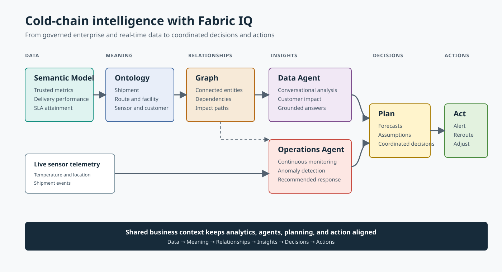

# Module 01 - Introduction and Overview: Fabric IQ

## Overview

Microsoft Fabric brings together analytical, operational, and real-time data into a unified platform. Fabric IQ adds the business context that allows people and AI agents to understand, reason over, and act upon that data using a common business vocabulary. Fabric IQ provides the intelligence layer that transforms data into business understanding and business understanding into action. 

In this module, we introduce the core components of Fabric IQ and establish the foundation for the remainder of the workshop.

---

## Learning Objectives

After completing this module, you will be able to:

- Explain the purpose and value of Fabric IQ.
- Describe the role of a Power BI Semantic Model.
- Understand what an Ontology is and why it matters.
- Explain how Graph enables relationship-based analysis.
- Differentiate between Data Agents and Operations Agents.
- Understand the role of Plan in forecasting and business planning.
- Explain how all Fabric IQ components work together.

---

# Why Fabric IQ?

Organizations store data in tables, files, events, and databases. Businesses operate using concepts such as customers, products, orders, shipments, assets, and locations.

Fabric IQ provides a shared business context layer that enables:

- Consistent business definitions
- Trusted analytics
- Cross-domain reasoning
- Intelligent agents
- Operational decision making

Fabric IQ elevates enterprise data into business language so people and AI agents can reason using business concepts instead of technical structures.

---

# Fabric IQ Architecture

Fabric IQ consists of several complementary capabilities that work together:

1. Power BI Semantic Model
2. Graph
3. Ontology
4. Data Agent
5. Operations Agent
6. Plan

These capabilities build upon a unified OneLake foundation and create a common business understanding across analytics, AI, and operations.

 

---

# Power BI Semantic Model

A Power BI Semantic Model provides a curated analytical layer for the business.

It contains:

- Business measures
- KPIs
- Relationships
- Hierarchies
- Dimensions
- Calculations

Semantic models create a trusted source for analytics and reporting and ensure users work from a consistent set of business metrics. Fabric IQ can leverage semantic models to establish analytical context and business meaning. 

### Example Questions

- What was revenue last quarter?
- Which region exceeded forecast?
- What products generated the highest margin?

---

# Graph

Graph provides a representation of connected business information.

Graph enables:

- Relationship traversal
- Dependency analysis
- Impact analysis
- Connected reasoning
- Multi-hop exploration

Graph works closely with Ontology by visualizing and traversing business relationships defined within the ontology.

### Example Questions

- Which customers are connected to a delayed shipment?
- What upstream systems are affected by an outage?
- How is an operational issue related to a business outcome?

---

# Ontology

An Ontology represents the business using shared definitions, properties, and relationships.

An ontology includes:

- Entity Types
- Properties
- Relationships
- Rules
- Constraints
- Data Bindings

Examples of entity types might include:

- Customer
- Product
- Order
- Shipment
- Asset
- Sensor

Ontology creates a shared business vocabulary used by people, applications, and AI agents. By defining business concepts once, organizations can ensure consistent interpretation across reports, agents, and operational systems. 

### Example Questions

- Which customers are impacted by delayed shipments?
- Which products belong to a specific supply chain?
- Which assets support a given business process?

---

# Data Agent

A Fabric Data Agent acts as a virtual analyst for a specific business domain.

Data Agents enable users to ask natural language questions against governed enterprise data.

Data Agents can work with:

- Lakehouses
- Warehouses
- KQL Databases
- Semantic Models
- Ontologies

They provide conversational analytics without requiring users to write SQL, DAX, or KQL. 

### Example Questions

- What were the top selling products this month?
- Which customers have declining sales?
- Show me regions below forecast.

---

# Operations Agent

An Operations Agent extends intelligence from insights into actions.

Operations Agents continuously monitor operational and real-time data to:

- Detect anomalies
- Monitor conditions
- Recommend actions
- Trigger governed responses

Unlike Data Agents, which respond to user questions, Operations Agents continuously evaluate business and operational conditions. 

### Configure an Operations Agent

Use the [Microsoft Fabric operations agent configuration guide](https://learn.microsoft.com/en-us/fabric/real-time-intelligence/operations-agent#configure-an-operations-agent) to set up the agent:

1. **Instructions** - Define the agent's goals and provide instructions that describe how it should monitor and respond to operational conditions.

	

2. **Knowledge sources** - Select the data or knowledge sources that provide the operational context the agent needs.

	

3. **Properties** - Review the available properties and confirm that each property maps to the correct column in the underlying data.

	

4. **Rules and conditions** - Define and verify the conditions the agent evaluates against the selected properties.

5. **Generate the playbook** - Save the agent, then generate its playbook. The playbook summarizes the agent's goals, instructions, data, actions, monitored concepts, and evaluation rules.

### Example Scenarios

- Detect temperature violations in a cold-chain shipment.
- Monitor operational KPIs.
- Recommend corrective actions.
- Initiate approved workflows.

---

# Plan

Plan brings planning, forecasting, analytics, and reporting together within Fabric IQ.

Plan enables organizations to:

- Forecast future performance
- Perform what-if analysis
- Compare plan versus actual
- Collaborate on business assumptions
- Align planning with governed data

By leveraging existing semantic models, Plan ensures planning activities use the same trusted measures and dimensions used throughout the organization. 

### Example Scenarios

- Budget planning
- Revenue forecasting
- Capacity planning
- Supply chain forecasting

---

# How Everything Works Together

Consider a cold-chain shipping scenario.

### Power BI Semantic Model

Provides trusted metrics such as:

- Revenue
- Delivery performance
- Product loss
- SLA attainment

### Graph

Connects those concepts together through relationships.

### Ontology

Defines business concepts such as:

- Customer
- Product
- Shipment
- Route
- Facility
- Sensor

### Data Agent

Answers questions such as:

> Which customers are affected by current shipment delays?

### Operations Agent

Monitors live telemetry and identifies operational issues requiring attention.

### Plan

Allows business teams to adjust forecasts and business assumptions based on current conditions.

Together these capabilities transform:

**Data → Meaning → Relationships → Insights → Decisions → Actions** 

---

# Plan Demonstration

In this demonstration, we will:

- Review an existing Plan.
- Connect planning activities to governed business metrics.
- Compare planned versus actual performance.
- Explore how changing assumptions impacts forecasts.

The goal is to illustrate how organizations move from business insight into coordinated planning and execution. 

---

# Module Summary

Fabric IQ provides the business intelligence layer that enables data, analytics, AI agents, and operational systems to work together using a common business vocabulary.

The core components of Fabric IQ are:

- Power BI Semantic Models
- Graph
- Ontologies
- Data Agents
- Operations Agents
- Plan

The remaining modules will explore each of these capabilities in greater depth and demonstrate how they can be implemented to create enterprise-ready AI and data solutions.

<b>For Further Study</b>

<ul>
	<li><a href="https://learn.microsoft.com/en-us/fabric/iq/" target="_blank">Fabric IQ documentation</a></li>
	<li><a href="https://community.fabric.microsoft.com/blog/fbc_fabricupdatesblogs/from-data-platform-to-intelligence-platform-introducing-microsoft-fabric-iq/5172484" target="_blank">From Data Platform to Intelligence Platform: Introducing Microsoft Fabric IQ</a></li>
</ul>

Congratulations! You have completed this module on **Introduction and Overview: Fabric IQ**. You now understand the core capabilities of Fabric IQ and how they work together to transform enterprise data into business context, insights, decisions, and actions. When you're ready, <a href="02 - Fabric Data Agents.md" target="_blank">proceed to the next module</a>.
